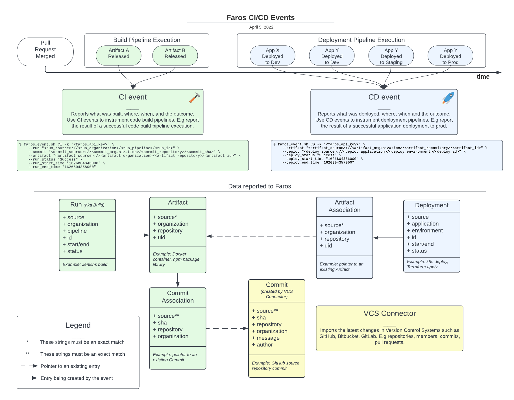

# :computer: Faros Events CLI [](https://github.com/faros-ai/faros-events-cli/actions/workflows/ci.yml) [](https://github.com/faros-ai/faros-events-cli/releases/latest)

CLI for reporting events to Faros platform.

The script provides all the necessary instrumentation for CI/CD pipelines by sending events to Faros platform

## :zap: Usage

### Execute with Bash

**Requirements**: Please make sure the following are installed before running the script - `curl`, `jq`, `sed` and an implementation of `awk` (we recommend `gawk`).

1. [Download the script manually](https://raw.githubusercontent.com/faros-ai/faros-events-cli/v0.5.1/faros_event.sh) and execute it:

```sh
./faros_event.sh help
```

2. Or download it with `curl` and invoke it in one command:

```sh
export FAROS_CLI_VERSION="v0.5.1"
curl -s https://raw.githubusercontent.com/faros-ai/faros-events-cli/$FAROS_CLI_VERSION/faros_event.sh | bash -s help
```

### Execute with Docker

**Requirements**: Docker client and runtime.

1. Pull the image:

```sh
docker pull farosai/faros-events-cli:v0.5.1
```

2. Run it:

```sh
docker run farosai/faros-events-cli:v0.5.1 help
```

### :book: Event Types

An event type (e.g. `CI`, `CD`, `TestExecution`) corresponds to the step of your CI/CD or Test pipeline that you are instrumenting.

- Use Continuous Integration (CI) events to instrument code build pipelines. For example, you can report the result of a successful code build & artifact release:

```sh
./faros_event.sh CI -k "<faros_api_key>" \
    --run "<run_source>://<run_organization>/<run_pipeline>/<run_id>" \
    --commit "<commit_source>://<commit_organization>/<commit_repository>/<commit_sha>" \
    --artifact "<artifact_source>://<artifact_organization>/<artifact_repository>/<artifact_id>" \
    --run_status "Success" \
    --run_start_time "1626804346000" \
    --run_end_time "1626804358000"
```

- Use Continuous Deployment (CD) events to instrument deployment pipelines. For example, you can report the result of a successful deployment of your application to an environment:

```sh
./faros_event.sh CD -k "<faros_api_key>" \
    --artifact "<artifact_source>://<artifact_organization>/<artifact_repository>/<artifact_id>" \
    --deploy "<deploy_source>://<deploy_application>/<deploy_environment>/<deploy_id>" \
    --deploy_status "Success" \
    --deploy_start_time "1626804356000" \
    --deploy_end_time "1626804357000"
```

- Use Test Execution (TestExecution) events to instrument test processes. For example, you can report the result of a successful test suite invocation:

```sh
./faros_event.sh TestExecution -k "<faros_api_key>" \
    --commit "<commit_source>://<commit_organization>/<commit_repository>/<commit_sha>" \
    --test_id "<test_id>" \
    --test_source "<test_source>" \
    --test_type "Functional" \
    --test_status "Success" \
    --test_suite "<test_suite>" \
    --test_stats "success=5,failure=0,total=5" \
    --test_start_time "1626804356000" \
    --test_end_time "Now"
```

Below is a more detailed diagram illustrating the use of CI, CD & TestExecution events:



### Arguments

There are two ways that arguments can be passed into the script. The first, is via flags. The second is via environment variables. You may use a combination of these two options. If both are set, flags will take precedence over environment variables.

:pencil: **Note**: By convention, you can switch between using a flag or an environment variable by simply capitalizing the argument name and prefixing it with `FAROS_`. For example, `--commit` becomes `FAROS_COMMIT`, `--artifact` becomes `FAROS_ARTIFACT`.

| Argument                            | Description                                                                                                                                                       | Required                                                                                                                                            | Default                                                                           |
| ----------------------------------- | ----------------------------------------------------------------------------------------------------------------------------------------------------------------- | --------------------------------------------------------------------------------------------------------------------------------------------------- | --------------------------------------------------------------------------------- |
| &#x2011;&#x2011;api_key             | Your Faros API key. See the documentation for more information on [obtaining an api key](https://docs.faros.ai/#/api?id=getting-access).                          | Yes (not required for [Faros Community Edition](https://github.com/faros-ai/faros-community-edition), i.e when `community_edition` flag is present) |                                                                                   |
| &#x2011;&#x2011;url                 | The Faros API url to send the event to.                                                                                                                           |                                                                                                                                                     | `https://prod.api.faros.ai` (`http://localhost:8080` for Faros Community Edition) |
| &#x2011;&#x2011;hasura_admin_secret | The Hasura Admin Secret.                                                                                                                                          |                                                                                                                                                     | "admin" (Only used in Faros Community Edition)                                    |
| &#x2011;&#x2011;graph               | The graph that the event should be sent to.                                                                                                                       |                                                                                                                                                     | "default"                                                                         |
| &#x2011;&#x2011;origin              | The origin of the event that is being sent to Faros.                                                                                                              |                                                                                                                                                     | "Faros_Script_Event"                                                              |
| &#x2011;&#x2011;dry_run             | Print the event instead of sending. (no value accepted, true if flag is present)                                                                                  |                                                                                                                                                     | False                                                                             |
| &#x2011;&#x2011;silent              | Unexceptional output will be silenced. (no value accepted, true if flag is present)                                                                               |                                                                                                                                                     | False                                                                             |
| &#x2011;&#x2011;debug               | Helpful information will be printed. (no value accepted, true if flag is present)                                                                                 |                                                                                                                                                     | False                                                                             |
| &#x2011;&#x2011;skip_saving_run     | Do not include cicd_Build in the event. (no value accepted, true if flag is present)                                                                              |                                                                                                                                                     | False                                                                             |
| &#x2011;&#x2011;no_lowercase_vcs    | Do not lowercase commit_organization and commit_repo. (no value accepted, true if flag is present)                                                                |                                                                                                                                                     | False                                                                             |
| &#x2011;&#x2011;validate_only       | Event will not be consumed but instead will only be validated against event schema. (no value accepted, true if flag is present)                                  |                                                                                                                                                     | False                                                                             |
| &#x2011;&#x2011;community_edition   | Events will be formatted and sent to [Faros Community Edition](https://github.com/faros-ai/faros-community-edition). (no value accepted, true if flag is present) |                                                                                                                                                     | False                                                                             |

#### CI Event - `CI`

A `CI` event communicates the outcome of a code build pipeline execution, and its artifact.

#### CI Arguments

> You may need to scroll to the right to view the entire table.

| Argument                            | Description                                                                                                                                                   | Required                        | Allowed Value                                               |
| ----------------------------------- | ------------------------------------------------------------------------------------------------------------------------------------------------------------- | ------------------------------- | ----------------------------------------------------------- |
| &#x2011;&#x2011;commit              | The URI of the commit. (`<source>://<organization>/<repository>/<commit_sha>` e.g. `GitHub://faros-ai/my-repo/da500aa4f54cbf8f3eb47a1dc2c136715c9197b9`)      | Yes                             |                                                             |
| &#x2011;&#x2011;pull_request_number | The pull request number of the commit. (e.g. 123). Used only if --commit is included                                                                          |                                 |                                                             |
| &#x2011;&#x2011;artifact            | The URI of the artifact. (`<source>://<organization>/<repository>/<artifact_id>` e.g. `DockerHub://farosai/my-repo/da500aa4f54cbf8f3eb47a1dc2c136715c9197b9`) |                                 |                                                             |
| &#x2011;&#x2011;run                 | The URI of the job run that built the code. (`<source>://<organization>/<pipeline>/<run_id>` e.g. `Jenkins://faros-ai/my-pipeline/1234`)                      |                                 |                                                             |
| &#x2011;&#x2011;run_status          | The status of the job run that built the code.                                                                                                                | If &#x2011;&#x2011;run provided | Success, Failed, Canceled, Queued, Running, Unknown, Custom |
| &#x2011;&#x2011;run_name            | The name of the job run that built the code.                                                                                                                  |                                 |                                                             |
| &#x2011;&#x2011;run_status_details  | Any extra details about the status of the job run.                                                                                                            |                                 |                                                             |
| &#x2011;&#x2011;run_start_time      | The start time of the job run in milliseconds since the epoch, ISO-8601 string, or `Now`. (e.g. `1626804346019`, `2021-07-20T18:05:46.019Z`)                  |                                 |                                                             |
| &#x2011;&#x2011;run_end_time        | The end time of the job run in milliseconds since the epoch, ISO-8601 string, or `Now`. (e.g. `1626804346019`, `2021-07-20T18:05:46.019Z`)                    |                                 |                                                             |

#### CD Event - `CD`

A `CD` event communicates the outcome of an application deployment pipeline execution, and the environment (e.g. QA, Prod).

#### CD Arguments

> You may need to scroll to the right to view the entire table.

| Argument                              | Description                                                                                                                                                   | Required                                                  | Allowed Value                                                  |
| ------------------------------------- | ------------------------------------------------------------------------------------------------------------------------------------------------------------- | --------------------------------------------------------- | -------------------------------------------------------------- |
| &#x2011;&#x2011;deploy                | The URI of the deployment. (`<source>://<application>/<environment>/<deploy_id>` e.g. `ECS://my-app/Prod/1234`)                                               | Yes                                                       | `environment`: Prod, Staging, QA, Dev, Sandbox, Canary, Custom |
| &#x2011;&#x2011;deploy_status         | The status of the deployment.                                                                                                                                 | Yes                                                       | Success, Failed, Canceled, Queued, Running, RolledBack, Custom |
| &#x2011;&#x2011;artifact              | The URI of the artifact. (`<source>://<organization>/<repository>/<artifact_id>` e.g. `DockerHub://farosai/my-repo/da500aa4f54cbf8f3eb47a1dc2c136715c9197b9`) | Either &#x2011;&#x2011;commit or &#x2011;&#x2011;artifact |                                                                |
| &#x2011;&#x2011;commit                | The URI of the commit. (`<source>://<organization>/<repository>/<commit_sha>` e.g. `GitHub://faros-ai/my-repo/da500aa4f54cbf8f3eb47a1dc2c136715c9197b9`)      | Either &#x2011;&#x2011;commit or &#x2011;&#x2011;artifact |                                                                |
| &#x2011;&#x2011;pull_request_number   | The pull request number of the commit. (e.g. 123). Used only if --commit is included                                                                          |                                                           |                                                                |
| &#x2011;&#x2011;deploy_app_platform   | The compute platform that runs the application.                                                                                                               |                                                           |                                                                |
| &#x2011;&#x2011;deploy_env_details    | Any extra details about the deployment environment.                                                                                                           |                                                           |                                                                |
| &#x2011;&#x2011;deploy_status_details | Any extra details about the status of the deployment.                                                                                                         |                                                           |                                                                |
| &#x2011;&#x2011;deploy_start_time     | The start time of the deployment in milliseconds since the epoch, ISO-8601 string, or `Now`. (e.g. `1626804346019`, `2021-07-20T18:05:46.019Z`)               |                                                           |                                                                |
| &#x2011;&#x2011;deploy_end_time       | The end time of the deployment in milliseconds since the epoch, ISO-8601 string, or `Now`. (e.g. `1626804346019`, `2021-07-20T18:05:46.019Z`)                 |                                                           |                                                                |
| &#x2011;&#x2011;run                   | The URI of the job run executing the deployment. (`<source>://<organization>/<pipeline>/<run_id>` e.g. `Jenkins://faros-ai/my-pipeline/1234`)                 |                                                           |                                                                |
| &#x2011;&#x2011;run_status            | The status of the job run executing the deployment.                                                                                                           | If &#x2011;&#x2011;run provided                           | Success, Failed, Canceled, Queued, Running, Unknown, Custom    |
| &#x2011;&#x2011;run_status_details    | Any extra details about the status of the job run executing the deployment.                                                                                   |                                                           |                                                                |
| &#x2011;&#x2011;run_start_time        | The start time of the job run in milliseconds since the epoch, ISO-8601 string, or `Now`. (e.g. `1626804346019`, `2021-07-20T18:05:46.019Z`)                  |                                                           |                                                                |
| &#x2011;&#x2011;run_end_time          | The end time of the job run in milliseconds since the epoch, ISO-8601 string, or `Now`. (e.g. `1626804346019`, `2021-07-20T18:05:46.019Z`)                    |                                                           |                                                                |

#### Test Execution Event - `TestExecution`

A `TestExecution` event communicates the outcome, as well as the context, of a test.

#### Test Execution Arguments

> You may need to scroll to the right to view the entire table.

| Argument                            | Description                                                                                                                                                                                                                       | Required                                                                                                                                    | Allowed Value                                                                    |
| ----------------------------------- | --------------------------------------------------------------------------------------------------------------------------------------------------------------------------------------------------------------------------------- | ------------------------------------------------------------------------------------------------------------------------------------------- | -------------------------------------------------------------------------------- |
| &#x2011;&#x2011;commit              | The URI of the commit. (`<source>://<organization>/<repository>/<commit_sha>` e.g. `GitHub://faros-ai/my-repo/da500aa4f54cbf8f3eb47a1dc2c136715c9197b9`)                                                                          | Yes                                                                                                                                         |                                                                                  |
| &#x2011;&#x2011;test_id             | The unique identifier of the test within the test source system.                                                                                                                                                                  | Yes                                                                                                                                         |                                                                                  |
| &#x2011;&#x2011;test_source         | The test source system. (e.g. Jenkins)                                                                                                                                                                                            | Yes                                                                                                                                         |                                                                                  |
| &#x2011;&#x2011;test_type           | The type of the test that was executed.                                                                                                                                                                                           | Yes                                                                                                                                         | Functional, Integration, Manual, Performance, Regression, Security, Unit, Custom |
| &#x2011;&#x2011;test_type_details   | Additional details about the type of the test that was executed.                                                                                                                                                                  |                                                                                                                                             |                                                                                  |
| &#x2011;&#x2011;test_status         | The outcome status of the test execution.                                                                                                                                                                                         | Yes                                                                                                                                         | Success, Failure, Custom, Skipped, Unknown                                       |
| &#x2011;&#x2011;test_status_details | Additional details about the status of the outcome status of the test.                                                                                                                                                            |                                                                                                                                             |                                                                                  |
| &#x2011;&#x2011;test_suite          | The name of the test suite.                                                                                                                                                                                                       | Yes                                                                                                                                         |                                                                                  |
| &#x2011;&#x2011;test_stats          | The stats of the test outcome as a string of comma separated `key=value` pairs. (e.g. `success=5,failure=2,total=7`)                                                                                                              |                                                                                                                                             | failure=N,success=N,skipped=N,unknown=N,custom=N,total=N                         |
| &#x2011;&#x2011;test_start_time     | The start time of the test in milliseconds since the epoch, ISO-8601 string, or `Now`. (e.g. `1626804346019`, `2021-07-20T18:05:46.019Z`)                                                                                         |                                                                                                                                             |                                                                                  |
| &#x2011;&#x2011;test_end_time       | The end time of the test in milliseconds since the epoch, ISO-8601 string, or `Now`. (e.g. `1626804346019`, `2021-07-20T18:05:46.019Z`)                                                                                           |                                                                                                                                             |                                                                                  |
| &#x2011;&#x2011;test_tags           | A string of comma separated tags to associate with the test. (e.g. `tag1,tag2`)                                                                                                                                                   |                                                                                                                                             |                                                                                  |
| &#x2011;&#x2011;environments        | A string of comma separated environments to associate with the test. (e.g. `env1,env2`)                                                                                                                                           |                                                                                                                                             |                                                                                  |
| &#x2011;&#x2011;device_name         | The name of the device on which the test was executed. (e.g. MacBook)                                                                                                                                                             |                                                                                                                                             |                                                                                  |
| &#x2011;&#x2011;device_os           | The operating system of the device on which the test was executed. (e.g. `OSX`)                                                                                                                                                   |                                                                                                                                             |                                                                                  |
| &#x2011;&#x2011;device_browser      | The browser on which the test was executed. (e.g. `Chrome`)                                                                                                                                                                       |                                                                                                                                             |                                                                                  |
| &#x2011;&#x2011;device_type         | The type of the device on which the test was executed.                                                                                                                                                                            |                                                                                                                                             |                                                                                  |
| &#x2011;&#x2011;test_task           | A comma separated array of one or many unique identifiers of test tasks within the TMS (Task Management System). The outcome of a specific test for this execution can be provided as a `key=value` pair (e.g. `TEST-123=Success) |                                                                                                                                             | Allowed Statuses: Success, Failure, Custom, Skipped, Unknown                     |
| &#x2011;&#x2011;defect_task         | The unique identifier of the defect task within the TMS (Task Management System).                                                                                                                                                 |                                                                                                                                             |                                                                                  |
| &#x2011;&#x2011;test_suite_task     | The unique identifier of the test suite task within the TMS (Task Management System).                                                                                                                                             |                                                                                                                                             |                                                                                  |
| &#x2011;&#x2011;test_execution_task | The unique identifier of the test execution task within the TMS (Task Management System).                                                                                                                                         |                                                                                                                                             |                                                                                  |
| &#x2011;&#x2011;task_source         | The TMS (Task Management System). (e.g. Jira)                                                                                                                                                                                     | If &#x2011;&#x2011;test_task, &#x2011;&#x2011;defect_task, &#x2011;&#x2011;test_suite_task, or &#x2011;&#x2011;test_execution_task provided |                                                                                  |

### Usage with Faros Community Edition

When using Faros Community Edition, you can use the tool in exactly the same way as described above. Just include the `community_edition` flag. The Faros API key is not needed, since the tool will call your locally deployed Hasura to perform mutations derived from the events. See the [Faros Community Edition repo](https://github.com/faros-ai/faros-community-edition) for more details.

```sh
./faros_event.sh CI \
    --run "<run_source>://<run_organization>/<run_pipeline>/<run_id>" \
    --commit "<commit_source>://<commit_organization>/<commit_repository>/<commit_sha>" \
    --artifact "<artifact_source>://<artifact_organization>/<artifact_repository>/<artifact_id>" \
    --run_status "Success" \
    --run_start_time "1626804346000" \
    --run_end_time "1626804358000" \
    --community_edition
```

### :herb: Real life examples

The following sends an event that communicates that a deployment pipeline that is run by `Buildkite` which is called `payments-service-deploy-prod` was successful. It communicated that the application `payments-service` was successfully deployed with `ECS` to the `Prod` environment. It communicates that the artifact that was deployed is stored in `DockerHub` in the `my-app-repo` repository. And Finally it communicates the timestamps for the start and end of both the job run and the deployment.

```sh
./faros_event.sh CD -k "<api_key>" \
    --artifact "DockerHub://farosai/my-app-repo/285071b4d36c49fa699ae87345c3f4e61abba01b" \
    --run "Buildkite://faros-ai/payments-service-deploy-prod/4206ac01-9d2f-437d-992d-8f6857b68378" \
    --run_status "Success" \
    --run_start_time "1626804346000" \
    --run_end_time "1626804358000" \
    --deploy "ECS://payments-service/Prod/d-CGAKEHE8S" \
    --deploy_status "Success" \
    --deploy_start_time "1626804356000" \
    --deploy_end_time "1626804357000"
```

---

## :hammer: Development

### :white_check_mark: Testing & Checking for Bugs

We use [ShellSpec](https://github.com/shellspec/shellspec) to test our scripts and [ShellCheck](https://www.shellcheck.net/) to check for potential bugs.

#### Install using Homebrew

```sh
brew tap shellspec/shellspec
brew install shellspec shellcheck
```

#### Running the tests

Move to the `/test` directory and execute `shellspec`

```sh
cd test && shellspec
```

#### Checking for bugs

Go to root directory and execute:

```sh
shellcheck -s bash faros_event.sh
```
