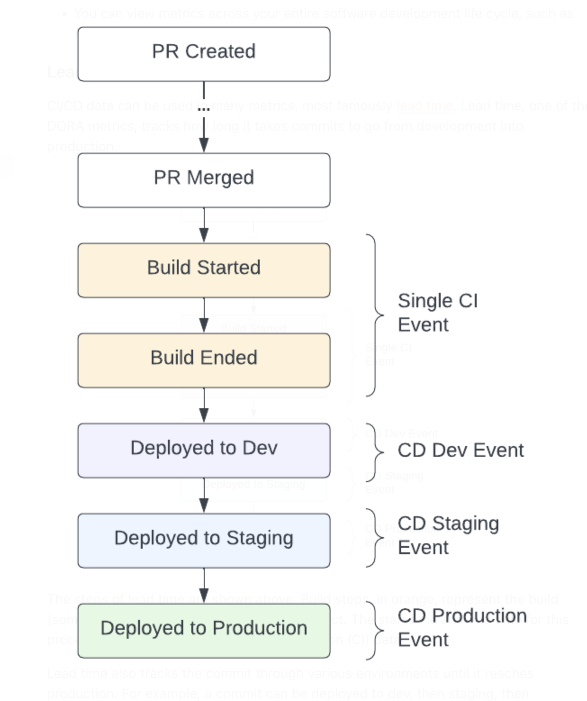

# :computer: Faros Events CLI [](https://github.com/faros-ai/faros-events-cli/actions/workflows/ci.yml) [](https://github.com/faros-ai/faros-events-cli/releases/latest)

CLI for reporting events to Faros platform.

- [Installation](#installation)
  - [Using Docker](#using-docker)
  - [Using Bash](#using-bash)
- [Instrumenting CI/CD pipelines](#instrumenting-cicd-pipelines)
  - [Reporting builds with commits (basic)](#reporting-builds-with-commits-basic)
  - [Reporting deployments with commits (basic)](#reporting-deployments-with-commits-basic)
  - [Reporting builds & deployments in parts (advanced)](#reporting-builds--deployments-in-parts-advanced)
  - [Reporting builds & deployments with commits & artifacts (advanced)](#reporting-builds--deployments-with-commits--artifacts-advanced)
  - [Reporting build steps](#reporting-build-steps)
- [Code quality](#code-quality)
  - [Reporting test execution results](#reporting-test-execution-results)
- [Arguments](#arguments)
  - [Passing arguments: flags or environment variables](#passing-arguments-flags-or-environment-variables)
  - [General arguments](#general-arguments)
  - [CI arguments](#ci-arguments)
  - [CD arguments](#cd-arguments)
  - [Test Execution arguments](#test-execution-arguments)
  - [URI arguments alternative](#uri-arguments-alternative)
  - [Additional arguments](#additional-arguments)
- [Tips](#tips)
  - [Validating your command](#validating-your-command)
  - [Usage with Faros Community Edition](#usage-with-faros-community-edition)
- [Development](#hammer-development)

## Installation

### Using Docker

**Requirements**: `docker`

```sh
docker pull farosai/faros-events-cli:v0.6.1 && docker run farosai/faros-events-cli:v0.6.1 help
```

### Using Bash

**Requirements**: `curl`, `jq`, `sed`, `awk` (we recommend `gawk`).

Either [download the script manually](https://raw.githubusercontent.com/faros-ai/faros-events-cli/v0.6.1/faros_event.sh) or invoke the script directly with curl:

```sh
curl -s https://raw.githubusercontent.com/faros-ai/faros-events-cli/v0.6.1/faros_event.sh | bash -s help
```

## Instrumenting CI/CD pipelines



### Reporting builds with commits (basic)

This CI event reports a successful code build:

```sh
./faros_event.sh CI -k "<faros_api_key>" \
    --commit "<commit_source>://<commit_organization>/<commit_repository>/<commit_sha>" \
    --run "<run_source>://<run_organization>/<run_pipeline>/<run_id>" \
    --run_status "Success" \
    --run_start_time "2021-07-20T18:05:46.019Z" \
    --run_end_time "2021-07-20T18:08:42.024Z"
```

### Reporting deployments with commits (basic)

This CD event reports a successful deployment of your application to your environment:

```sh
./faros_event.sh CD -k "<faros_api_key>" \
    --commit "<commit_source>://<commit_organization>/<commit_repository>/<commit_sha>" \
    --deploy "<deploy_source>://<deploy_application>/<deploy_environment>/<deploy_id>" \
    --deploy_status "Success" \
    --deploy_start_time "2021-07-20T18:05:46.019Z" \
    --deploy_end_time "2021-07-20T18:08:42.024Z"
```

### Reporting builds & deployments in parts (advanced)

Faros events are very flexible. Information can be sent all at once in a single event, or as it becomes available using multiple events. Certain fields depend on other fields to be present for Faros to correctly link information behind the scenes. See the [argument tables](#arguments) for dependency information.

#### Sending build information in parts

You can send a CI event when a code build has started. And a final event, when the code build has finished successfully.

Code build started:

```sh
./faros_event.sh CI -k "<faros_api_key>" \
    --commit "<commit_source>://<commit_organization>/<commit_repository>/<commit_sha>" \
    --run "<run_source>://<run_organization>/<run_pipeline>/<run_id>" \
    --run_status "Running" \
    --run_start_time "Now"
```

Code build finished successfully:

```sh
./faros_event.sh CI -k "<faros_api_key>" \
    --run "<run_source>://<run_organization>/<run_pipeline>/<run_id>" \
    --run_status "Success" \
    --run_end_time "Now"
```

#### Sending deployment information in parts

You can send a CD event when an deployment has started. Then later, you can send an event when that deployment has finished successfully.

Deployment started:

```sh
./faros_event.sh CD -k "<faros_api_key>" \
    --commit "<commit_source>://<commit_organization>/<commit_repository>/<commit_sha>" \
    --deploy "<deploy_source>://<deploy_application>/<deploy_environment>/<deploy_id>" \
    --deploy_status "Running" \
    --deploy_start_time "Now"
```

Deployment finished successfully:

```sh
./faros_event.sh CD -k "<faros_api_key>" \
    --deploy "<deploy_source>://<deploy_application>/<deploy_environment>/<deploy_id>" \
    --deploy_status "Success" \
    --deploy_end_time "Now"
```

### Reporting builds & deployments with commits & artifacts (advanced)

When the commit information is not available at the time of deployment, you will need to use the `--artifact` flag. This flag lets Faros know that a commit was built into an artifact so that when you deploy that artifact, Faros knows how it all links together.

This CD event reports that a commit was successfully built into the specified artifact:

```sh
./faros_event.sh CI -k "<faros_api_key>" \
    --commit "<commit_source>://<commit_organization>/<commit_repository>/<commit_sha>" \
    --artifact "<artifact_source>://<artifact_organization>/<artifact_repository>/<artifact_id>" \
    --run "<run_source>://<run_organization>/<run_pipeline>/<run_id>" \
    --run_status "Success" \
    --run_start_time "2021-07-20T18:05:46.019Z" \
    --run_end_time "2021-07-20T18:08:42.024Z"
```

This CD event reports the successful deployment of an application to an environment using that artifact:

```sh
./faros_event.sh CD -k "<faros_api_key>" \
    --artifact "<artifact_source>://<artifact_organization>/<artifact_repository>/<artifact_id>" \
    --deploy "<deploy_source>://<deploy_application>/<deploy_environment>/<deploy_id>" \
    --deploy_status "Success" \
    --deploy_start_time "2021-07-20T18:05:46.019Z" \
    --deploy_end_time "2021-07-20T18:08:42.024Z"
```

Same as in the [earlier section](#reporting-builds--deployments-in-parts-advanced), you can report this information in parts, e.g. build started, build completed, deploy started, deploy completed.

### Reporting build steps

In addition to tracking build outcomes, you can also instrument specific steps in your build processes.

After reporting the start of a build:

```sh
./faros_event.sh CI -k "<faros_api_key>" \
    --commit "<commit_source>://<commit_organization>/<commit_repository>/<commit_sha>" \
    --run "<run_source>://<run_organization>/<run_pipeline>/<run_id>" \
    --run_start_time "Now"
```

You can report the start of a specific build step:

```sh
./faros_event.sh CI -k "<faros_api_key>" \
    --run "<run_source>://<run_organization>/<run_pipeline>/<run_id>" \
    --run_step_id "<run_step_id>" \
    --run_step_start_time "Now"
```

Then report its outcome and end time:

```sh
./faros_event.sh CI -k "<faros_api_key>" \
    --run "<run_source>://<run_organization>/<run_pipeline>/<run_id>" \
    --run_step_id "<run_step_id>" \
    --run_step_status "Success" \
    --run_step_end_time "Now"
```

Don't forget to report the end of the build itself!

```sh
./faros_event.sh CI -k "<faros_api_key>" \
    --run "<run_source>://<run_organization>/<run_pipeline>/<run_id>" \
    --run_status "Success" \
    --run_end_time "Now"
```

## Code quality

### Reporting test execution results

> :exclamation: `--full` flag must be provided with TestExecution event

This event reports a successful test suite invocation:

```sh
./faros_event.sh TestExecution -k "<faros_api_key>" \
    --commit "<commit_source>://<commit_organization>/<commit_repository>/<commit_sha>" \
    --test_id "<test_id>" \
    --test_source "<test_source>" \
    --test_type "Functional" \
    --test_status "Success" \
    --test_suite "<test_suite_id>" \
    --test_stats "failure=0,success=18,skipped=3,unknown=0,custom=2,total=23" \
    --test_start_time "2021-07-20T18:05:46.019Z" \
    --test_end_time "2021-07-20T18:08:42.024Z" \
    --full
```

## Arguments

### Passing arguments: flags or environment variables

There are two ways that arguments can be passed into the script. The first, is via flags. The second is via environment variables. You may use a combination of these two options. If both are set, flags will take precedence over environment variables.

:pencil: **Note**: By convention, you can switch between using a flag or an environment variable by simply capitalizing the argument name and prefixing it with `FAROS_`. For example, `--commit` becomes `FAROS_COMMIT`, `--artifact` becomes `FAROS_ARTIFACT`.

### General arguments

| Argument                           | Description                                                                                                                              | Required                                                      | Default                                                                           |
| ---------------------------------- | ---------------------------------------------------------------------------------------------------------------------------------------- | ------------------------------------------------------------- | --------------------------------------------------------------------------------- |
| &#x2011;k, &#x2011;&#x2011;api_key | Your Faros API key. See the documentation for more information on [obtaining an api key](https://docs.faros.ai/#/api?id=getting-access). | Yes (not required when `--community_edition` flag is present) |                                                                                   |
| &#x2011;u, &#x2011;&#x2011;url     | The Faros API url to send the event to.                                                                                                  |                                                               | `https://prod.api.faros.ai` (`http://localhost:8080` for Faros Community Edition) |
| &#x2011;g, &#x2011;&#x2011;graph   | The graph that the event should be sent to.                                                                                              |                                                               | "default"                                                                         |
| &#x2011;&#x2011;validate_only      | Event will not be consumed but instead will only be validated against event schema.                                                      |                                                               |                                                                                   |
| &#x2011;&#x2011;dry_run            | Print the event instead of sending.                                                                                                      |                                                               |                                                                                   |
| &#x2011;&#x2011;community_edition  | Events will be formatted and sent to [Faros Community Edition](https://github.com/faros-ai/faros-community-edition).                     |                                                               |                                                                                   |

### CI arguments

| Argument                                | Description                                                                                                                                | Dependency |
| --------------------------------------- | ------------------------------------------------------------------------------------------------------------------------------------------ | ---------- |
| &#x2011;&#x2011;run                     | The URI of the job run that built the code. (`<source>://<organization>/<pipeline>/<run_id>`)                                              |            |
| &#x2011;&#x2011;run_status              | The status of the job run that built the code. (Allowed values: `Success`, `Failed`, `Canceled`, `Queued`, `Running`, `Unknown`, `Custom`) | --run      |
| &#x2011;&#x2011;run_status_details      | Any extra details about the status of the job run.                                                                                         | --run      |
| &#x2011;&#x2011;run_start_time          | The start time of the job run in milliseconds since the epoch, ISO-8601, or `Now`. (e.g. `1626804346019`, `2021-07-20T18:05:46.019Z`)      | --run      |
| &#x2011;&#x2011;run_end_time            | The end time of the job run in milliseconds since the epoch, ISO-8601, or `Now`. (e.g. `1626804346019`, `2021-07-20T18:05:46.019Z`)        | --run      |
| &#x2011;&#x2011;run_name                | The name of the job run that built the code.                                                                                               | --run      |
| &#x2011;&#x2011;commit                  | The URI of the commit. (`<commit_source>://<commit_organization>/<commit_repository>/<commit_sha>`)                                        | --run      |
| &#x2011;&#x2011;artifact                | The URI of the artifact. (`<source>://<organization>/<repository>/<artifact_id>`)                                                          | --commit   |
| &#x2011;&#x2011;pull_request_number     | The pull request number of the commit. (e.g. `123`).                                                                                       | --commit   |
| &#x2011;&#x2011;run_step_id             | The id of the job run step. (e.g. `123`).                                                                                                  | --run      |
| &#x2011;&#x2011;run_step_name           | The name of the job run step (e.g. `Lint`).                                                                                                | --run      |
| &#x2011;&#x2011;run_step_status         | The status of the job run step. (Allowed values: `Success`, `Failed`, `Canceled`, `Queued`, `Running`, `Unknown`, `Custom`)                | --run      |
| &#x2011;&#x2011;run_step_status_details | Any extra details about the status of the job run step.                                                                                    | --run      |
| &#x2011;&#x2011;run_step_type           | The type of the job run step. (Allowed values: `Script`, `Manual`, `Custom`)                                                               | --run      |
| &#x2011;&#x2011;run_step_type_details   | Any extra details about the type of the job run step.                                                                                      | --run      |
| &#x2011;&#x2011;run_step_start_time     | The start time of the job run step in milliseconds since the epoch, ISO-8601, or `Now`. (e.g. `1626804346019`, `2021-07-20T18:05:46.019Z`) | --run      |
| &#x2011;&#x2011;run_step_end_time       | The end time of the job run step in milliseconds since the epoch, ISO-8601, or `Now`. (e.g. `1626804346019`, `2021-07-20T18:05:46.019Z`)   | --run      |
| &#x2011;&#x2011;run_step_command        | The command executed by the job run step.                                                                                                  | --run      |
| &#x2011;&#x2011;run_step_url            | The url to the job run step.                                                                                                               | --run      |

### CD arguments

| Argument                              | Description                                                                                                                                                                                                                           | Dependency |
| ------------------------------------- | ------------------------------------------------------------------------------------------------------------------------------------------------------------------------------------------------------------------------------------- | ---------- |
| &#x2011;&#x2011;deploy                | The URI of the deployment. (`<deploy_source>://<application>/<environment>/<deploy_id>`) (`<environment>` allowed values: `Prod`, `Staging`, `QA`, `Dev`, `Sandbox`, `Canary`, `Custom`)                                              |            |
| &#x2011;&#x2011;deploy_start_time     | The start time of the deployment in milliseconds since the epoch, ISO-8601, or `Now`. (e.g. `1626804346019`, `2021-07-20T18:05:46.019Z`)                                                                                              | --deploy   |
| &#x2011;&#x2011;deploy_end_time       | The end time of the deployment in milliseconds since the epoch, ISO-8601, or `Now`. (e.g. `1626804346019`, `2021-07-20T18:05:46.019Z`)                                                                                                | --deploy   |
| &#x2011;&#x2011;deploy_requested_at   | The time the deployment was requested in milliseconds since the epoch, ISO-8601, or `Now`. (e.g. `1626804346019`, `2021-07-20T18:05:46.019Z`)                                                                                         | --deploy   |
| &#x2011;&#x2011;deploy_status         | The status of the deployment. (Allowed values: `Success`, `Failed`, `Canceled`, `Queued`, `Running`, `RolledBack`, `Custom`)                                                                                                          | --deploy   |
| &#x2011;&#x2011;deploy_status_details | Any extra details about the status of the deployment.                                                                                                                                                                                 | --deploy   |
| &#x2011;&#x2011;deploy_url            | The url of the deployment.                                                                                                                                                                                                            | --deploy   |
| &#x2011;&#x2011;deploy_app_platform   | The compute platform that runs the application.                                                                                                                                                                                       | --deploy   |
| &#x2011;&#x2011;deploy_env_details    | Any extra details about the deployment environment.                                                                                                                                                                                   | --deploy   |
| &#x2011;&#x2011;commit                | The URI of the commit. If you specify `--artifact` in your CI events, you should use `--artifact` in your CD events. Otherwise, use `--commit`. (`<source>://<organization>/<repository>/<commit_sha>`)                               | --deploy   |
| &#x2011;&#x2011;artifact              | The URI of the artifact. If you specify `--artifact` in your CI events, you should use `--artifact` in your CD events. Otherwise, use `--commit`. (`<artifact_source>://<artifact_organization>/<artifact_repository>/<artifact_id>`) | --deploy   |
| &#x2011;&#x2011;pull_request_number   | The pull request number of the commit. (e.g. 123). Used only if --commit is included                                                                                                                                                  | --commit   |
| &#x2011;&#x2011;run                   | The URI of the job run executing the deployment. (`<source>://<organization>/<pipeline>/<run_id>` e.g. `Jenkins://faros-ai/my-pipeline/1234`)                                                                                         |            |
| &#x2011;&#x2011;run_status            | The status of the job run executing the deployment. (Allowed values: `Success`, `Failed`, `Canceled`, `Queued`, `Running`, `Unknown`, `Custom`)                                                                                       | --run      |
| &#x2011;&#x2011;run_status_details    | Any extra details about the status of the job run executing the deployment.                                                                                                                                                           | --run      |
| &#x2011;&#x2011;run_start_time        | The start time of the job run in milliseconds since the epoch, ISO-8601, or `Now`. (e.g. `1626804346019`, `2021-07-20T18:05:46.019Z`)                                                                                                 | --run      |
| &#x2011;&#x2011;run_end_time          | The end time of the job run in milliseconds since the epoch, ISO-8601, or `Now`. (e.g. `1626804346019`, `2021-07-20T18:05:46.019Z`)                                                                                                   | --run      |

### Test Execution arguments

| Argument                            | Description                                                                                                                                                                                                                                                                                                                      | Required                                                                                                                                    |
| ----------------------------------- | -------------------------------------------------------------------------------------------------------------------------------------------------------------------------------------------------------------------------------------------------------------------------------------------------------------------------------- | ------------------------------------------------------------------------------------------------------------------------------------------- |
| &#x2011;&#x2011;commit              | The URI of the commit. (`<source>://<organization>/<repository>/<commit_sha>` e.g. `GitHub://faros-ai/my-repo/da500aa4f54cbf8f3eb47a1dc2c136715c9197b9`)                                                                                                                                                                         | Yes                                                                                                                                         |
| &#x2011;&#x2011;pull_request_number | The pull request number of the commit. (e.g. 123).                                                                                                                                                                                                                                                                               |                                                                                                                                             |
| &#x2011;&#x2011;test_id             | The unique identifier of the test within the test source system.                                                                                                                                                                                                                                                                 | Yes                                                                                                                                         |
| &#x2011;&#x2011;test_source         | The test source system. (e.g. `Jenkins`)                                                                                                                                                                                                                                                                                         | Yes                                                                                                                                         |
| &#x2011;&#x2011;test_type           | The type of the test that was executed: (Allowed values: `Functional`, `Integration`, `Manual`, `Performance`, `Regression`, `Security`, `Unit`, `Custom`)                                                                                                                                                                       | Yes                                                                                                                                         |
| &#x2011;&#x2011;test_type_details   | Additional details about the type of the test that was executed.                                                                                                                                                                                                                                                                 |                                                                                                                                             |
| &#x2011;&#x2011;test_status         | The outcome status of the test execution. (Allowed values: `Success`, `Failure`, `Custom`, `Skipped`, `Unknown`)                                                                                                                                                                                                                 | Yes                                                                                                                                         |
| &#x2011;&#x2011;test_status_details | Additional details about the status of the outcome status of the test.                                                                                                                                                                                                                                                           |                                                                                                                                             |
| &#x2011;&#x2011;test_suite          | The name of the test suite.                                                                                                                                                                                                                                                                                                      | Yes                                                                                                                                         |
| &#x2011;&#x2011;test_stats          | The stats of the test outcome as a string of comma separated `key=value` pairs. (e.g. `failure=0,success=18,skipped=3,unknown=0,custom=2,total=23`)                                                                                                                                                                              |                                                                                                                                             |
| &#x2011;&#x2011;test_start_time     | The start time of the test in milliseconds since the epoch, ISO-8601, or `Now`. (e.g. `1626804346019`, `2021-07-20T18:05:46.019Z`)                                                                                                                                                                                               |                                                                                                                                             |
| &#x2011;&#x2011;test_end_time       | The end time of the test in milliseconds since the epoch, ISO-8601, or `Now`. (e.g. `1626804346019`, `2021-07-20T18:05:46.019Z`)                                                                                                                                                                                                 |                                                                                                                                             |
| &#x2011;&#x2011;test_tags           | A string of comma separated tags to associate with the test. (e.g. `tag1,tag2`)                                                                                                                                                                                                                                                  |                                                                                                                                             |
| &#x2011;&#x2011;environments        | A string of comma separated environments to associate with the test. (e.g. `env1,env2`)                                                                                                                                                                                                                                          |                                                                                                                                             |
| &#x2011;&#x2011;device_name         | The name of the device on which the test was executed. (e.g. `MacBook`)                                                                                                                                                                                                                                                          |                                                                                                                                             |
| &#x2011;&#x2011;device_os           | The operating system of the device on which the test was executed. (e.g. `OSX`)                                                                                                                                                                                                                                                  |                                                                                                                                             |
| &#x2011;&#x2011;device_browser      | The browser on which the test was executed. (e.g. `Chrome`)                                                                                                                                                                                                                                                                      |                                                                                                                                             |
| &#x2011;&#x2011;device_type         | The type of the device on which the test was executed.                                                                                                                                                                                                                                                                           |
| &#x2011;&#x2011;task_source         | The type of TMS (Task Management System). (e.g. `Jira`, `Shortcut`, `GitHub`)                                                                                                                                                                                                                                                    | If &#x2011;&#x2011;test_task, &#x2011;&#x2011;defect_task, &#x2011;&#x2011;test_suite_task, or &#x2011;&#x2011;test_execution_task provided |
| &#x2011;&#x2011;test_task           | A comma separated array of one or many unique identifiers of test tasks within the TMS (Task Management System). The outcome of a specific test for this execution can be provided as a `key=value` pair (e.g. `TEST-123=Success,TEST-456=Failure` with allowed statuses: `Success`, `Failure`, `Custom`, `Skipped`, `Unknown` ) |                                                                                                                                             |
| &#x2011;&#x2011;defect_task         | The unique identifier of the defect task within the TMS (Task Management System).                                                                                                                                                                                                                                                |                                                                                                                                             |
| &#x2011;&#x2011;test_suite_task     | The unique identifier of the test suite task within the TMS (Task Management System).                                                                                                                                                                                                                                            |                                                                                                                                             |
| &#x2011;&#x2011;test_execution_task | The unique identifier of the test execution task within the TMS (Task Management System).                                                                                                                                                                                                                                        |                                                                                                                                             |

### URI arguments alternative

Sometimes using the URI format required by `--run`, `--commit`, `--artifact`, or `--deploy` arguments gets in the way. For example when your commit repository has a `/` in the name. Here is how you can supply the required information as individual fields instead. Each alternative requires **all** listed fields.

#### `--run` argument alternative (**all** listed fields are required)

| Argument                     | Description                  |
| ---------------------------- | ---------------------------- |
| &#x2011;&#x2011;run_id       | The id of the run            |
| &#x2011;&#x2011;run_pipeline | The pipeline of the run      |
| &#x2011;&#x2011;run_org      | The organization of the run  |
| &#x2011;&#x2011;run_source   | The source system of the run |

#### `--deploy` argument alternative (**all** listed fields are required)

| Argument                      | Description                                                                                                       |
| ----------------------------- | ----------------------------------------------------------------------------------------------------------------- |
| &#x2011;&#x2011;deploy_id     | The id of the deployment                                                                                          |
| &#x2011;&#x2011;deploy_env    | The environment of the deployment (allowed values: `Prod`, `Staging`, `QA`, `Dev`, `Sandbox`, `Canary`, `Custom`) |
| &#x2011;&#x2011;deploy_app    | The application being deployed                                                                                    |
| &#x2011;&#x2011;deploy_source | The source system of the deployment                                                                               |

#### `--commit` argument alternative (**all** listed fields are required)

| Argument                      | Description                          |
| ----------------------------- | ------------------------------------ |
| &#x2011;&#x2011;commit_sha    | The SHA of the commit                |
| &#x2011;&#x2011;commit_repo   | The repository of the commit         |
| &#x2011;&#x2011;commit_org    | The organization of the commit       |
| &#x2011;&#x2011;commit_source | The source system storing the commit |

#### `--artifact` argument alternative (**all** listed fields are required)

| Argument                        | Description                            |
| ------------------------------- | -------------------------------------- |
| &#x2011;&#x2011;artifact_id     | The id of the artifact                 |
| &#x2011;&#x2011;artifact_repo   | The repository of the artifact         |
| &#x2011;&#x2011;artifact_org    | The organization of the artifact       |
| &#x2011;&#x2011;artifact_source | The source system storing the artifact |

### Additional arguments

| Argument                            | Description                                                         | Default              |
| ----------------------------------- | ------------------------------------------------------------------- | -------------------- |
| &#x2011;&#x2011;origin              | The origin of the event that is being sent to Faros.                | "Faros_Script_Event" |
| &#x2011;&#x2011;full                | The event being sent should be validated as a full event.           |                      |
| &#x2011;&#x2011;silent              | Unexceptional output will be silenced.                              |                      |
| &#x2011;&#x2011;debug               | Helpful information will be printed.                                |                      |
| &#x2011;&#x2011;skip_saving_run     | Do not include `cicd_Build` in the event.                           |                      |
| &#x2011;&#x2011;no_lowercase_vcs    | Do not lowercase commit_organization and commit_repo.               |                      |
| &#x2011;&#x2011;hasura_admin_secret | The Hasura Admin Secret. Only used with `‑‑community_edition` flag. | "admin"              |

---

## Tips

### Validating your command

As you are iterating on instrumentation you can use the `--validate-only` flag to test before you are ready to send actual data:

```sh
./faros_event.sh <...your command arguments...> --validate_only
```

### Usage with Faros Community Edition

> :exclamation: Sending events in parts is not currently supported
> :exclamation: Build steps in CI events are not currently supported
> :exclamation: Test Execution events are not currently supported

When using Faros Community Edition, you can use the tool in exactly the same way as described above. Just include the `--community_edition` flag. The Faros API key is not needed, since the tool will call your locally deployed Hasura to perform mutations derived from the events. See the [Faros Community Edition repo](https://github.com/faros-ai/faros-community-edition) for more details.

```sh
./faros_event.sh <...your command arguments...> --community_edition
```

## :hammer: Development

### :white_check_mark: Testing & Checking for Bugs

We use [ShellSpec](https://github.com/shellspec/shellspec) to test our scripts and [ShellCheck](https://www.shellcheck.net/) to check for potential bugs.

#### Install using Homebrew

```sh
brew tap shellspec/shellspec
brew install shellspec shellcheck
```

#### Running the tests

Move to the `/test` directory and execute `shellspec`

```sh
cd test && shellspec
```

#### Checking for bugs

Go to root directory and execute:

```sh
shellcheck -s bash faros_event.sh
```
